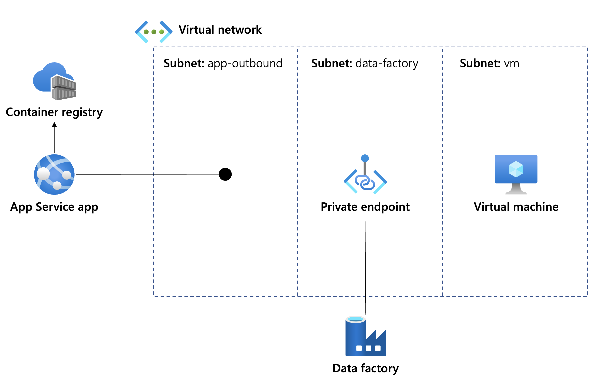

# Azure Data Factory self-hosted integration runtime on App Service

This sample illustrates how to host an [Azure Data Factory self-hosted integration runtime](https://docs.microsoft.com/azure/data-factory/concepts-integration-runtime) in Azure App Service.

By using this approach, you can gain the benefits of using a self-hosted integration runtime while avoiding having to manage virtual machines or other infrastructure.

## Approach and architecture

This sample runs the self-hosted integration in a Windows container on App Service. Azure Data Factory [supports running a self-hosted integration runtime on Windows containers](https://docs.microsoft.com/azure/data-factory/how-to-run-self-hosted-integration-runtime-in-windows-container), and [they provide a GitHub repository](https://github.com/Azure/Azure-Data-Factory-Integration-Runtime-in-Windows-Container) with a Dockerfile and associated scripts. Azure Container Registry builds the Dockerfile by using [ACR tasks](https://docs.microsoft.com/azure/container-registry/container-registry-tasks-overview).

The App Service container app uses [VNet integration](https://docs.microsoft.com/azure/app-service/overview-vnet-integration) to connect to a virtual network. This means that the self-hosted integration runtime can [connect to Data Factory by using a private endpoint](https://docs.microsoft.com/azure/data-factory/data-factory-private-link), and it can also access servers and other resources that are accessible thorugh the virtual network.

To illustrate the end-to-end flow, the sample deploys an example Data Factory pipeline that connects to a web server on a virtual machine by using a private IP address.

### Architecture diagram



These are the data flows used by the solution:

1. When the app starts, App Service pulls the container image from the container registry.
    - The app uses a managed identity to pull the container image from the container registry. However, App Service requires that the `DOCKER_REGISTRY_SERVER_*` settings are in the app's settings.
    - [App Service doesn't support](https://azure.github.io/AppService/2021/07/03/Linux-container-from-ACR-with-private-endpoint.html#:~:text=Windows%20containers%20do%20not%20support%20pulling%20images%20over%20virtual%20network%20integration) pulling a Windows container image through a VNet-integrated container registry.
1. After the container is started, the self-hosted integration runtime loads. It connects to the data factory by using a private endpoint.
1. When the data factory's pipeline runs, the self-hosted integration runtime accesses the web server on the virtual machine.

## Deploy and test the sample

The entire deployment is defined as a Bicep file, with a series of modules to deploy each part of the solution.

To run the deployment, first create a resource group, such as by using the following Azure CLI command:

```azurecli
az group create \
  --name SHIR \
  --location australiaeast
```

Next, initiate the deployment of the Bicep file. The only mandatory parameter is `vmAdminPassword`, which must be set to a value that conforms to the password naming rules for virtual machines. The following Azure CLI command initiates the deployment:

```azurecli
az deployment group create \
  --resource-group SHIR \
  --template-file deploy/main.bicep \
  --parameters 'vmAdminPassword=<YOUR-VM-ADMIN-PASSWORD>' ['irNodeExpirationTime=<TIME-IN-SECONDS>']
```

where the optional parameter `irNodeExpirationTime` specifies the time in seconds when the offline nodes expire after App Service stops or restarts. The expired nodes will be removed automatically during next restarting. The minimum expiration time, as well as the default value, is 600 seconds (10 minutes).

The deployment takes approximately 30-45 minutes to complete. The majority of this time is the step to build the container image within Azure Container Registry.

After the deployment completes, wait about another 10-15 minutes for App Service to deploy the container image. You can monitor the progress of this step by using the Deployment Center page on the App Service app resource in the Azure portal.

To test the deployment when it's completed:

1. Open the Azure portal, navigate to the resource group (named *SHIR* by default), and open the data factory.
1. Select **Open Azure Data Factory Studio**. A separate page opens up in your browser.
1. On the left navigation bar, select **Manage**, and then select **Integration runtimes**. Look at the **self-hosted-runtime** item. The status should show as *Available*. If it says *Unavailable*, it probably means the container is still starting. Wait a few minutes and refresh the list.
1. On the left navigation bar, select **Author**.
1. Under **Pipelines**, select **sample-pipeline**. The pipeline opens. There's a single task named *GetWebContent*.
1. On the toolbar, select **Debug** to start the pipeline running. The run appears in the bottom pane. Wait a few moments and select the refresh button on the bottom pane's toolbar.
1. The task shows the *Succeeded* status. This means the self-hosted integration runtime successfully connected to the web server on the virtual machine and accessed its data.

## Note

In this sample, we use App Service to host the container because the other serverless/PaaS container hosting options in Azure don't support VNet integration with Windows containers (at least at the time of writing, June 2022).
